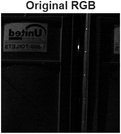
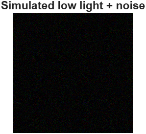
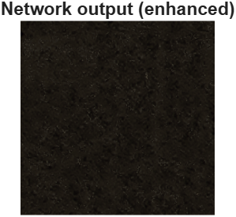
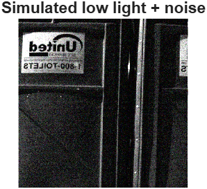
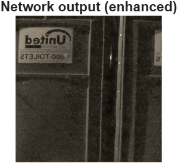
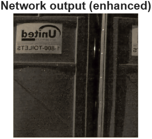
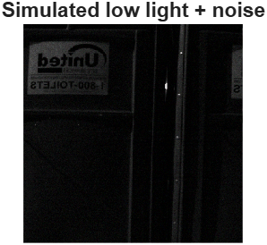
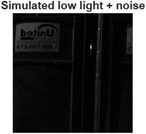
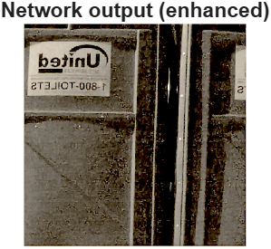

# 🧪 Lab 10 : Low-Light Image Enhancement with a Pretrained SID Model

## 🎯 Objective
The primary objective of this laboratory assignment is to demonstrate the practical application of a pretrained deep learning model for low-light image enhancement, specifically using the SID (Seeing in the Dark) network architecture within the MATLAB environment.

---

## 1️⃣ Running Original Code
 
 
 

- The provided MATLAB script serves as a simple framework for detecting metal studs on tires using conventional Image Processing techniques, without relying on deep learning or AI.
- The core objective is to process tire images, isolate the tire area, identify potential studs based on brightness and morphology, and classify the tire type.


```
%%CODE%%
%% Simple demo of "Learning to See in the Dark" pretrained network
% Goal:
% Use the pretrained low-light enhancement network WITHOUT
% downloading the huge SID dataset or doing any training.
%
% Steps:
% 1) Download pretrained model (small .zip) if needed.
% 2) Load the trained network.
% 3) Simulate a dark + noisy image.
% 4) Run the network and compare results.
clear; clc; close all;
%% 1) Download pretrained network (only once)
% Use the same URL as in the MathWorks example.
dataDir = fullfile(tempdir, "Sony2025"); % or use pwd for current folder
if ~exist(dataDir, "dir")
mkdir(dataDir);
end
modelFile = fullfile(dataDir, "trainedLowLightCameraPipelineNet.mat");
if ~isfile(modelFile)
fprintf("Downloading pretrained low-light model...\n");
% URL from the official example
modelURL = "https://ssd.mathworks.com/supportfiles/" + ...
"vision/data/trainedLowLightCameraPipelineDlnetwork.zip";
zipFile = fullfile(dataDir, "trainedLowLightCameraPipelineDlnetwork.zip");
% Download zip file
websave(zipFile, modelURL);
% Unzip to dataDir
unzip(zipFile, dataDir);
fprintf("Download complete. Model saved in:\n%s\n", dataDir);
end
%% 2) Load pretrained network
% The MAT file contains a variable called 'netTrained'.
load(modelFile, "netTrained");
%% 3) Read a normal RGB image (built-in example)
I = imread("peppers.png"); % You can replace with any RGB image
I = im2single(imresize(I, [512 512])); % Resize to 512x512 and convert to single
%% 4) Simulate a very dark, noisy low-light image
darkFactor = 0.03; % Make image very dark
I_dark = I * darkFactor; % Reduce brightness
I_dark_noisy = imnoise(I_dark, "gaussian", 0, 0.002); % Add noise
%% 5) Build a simple 4-channel "fake RAW" input
% In the real SID example:
% - RAW Bayer data is split into 4 channels (R, G1, G2, B).
% Here we keep it simple:
% - Convert to grayscale and copy into 4 channels.
I_gray = rgb2gray(I_dark_noisy); % H x W
rawFake = repmat(I_gray, 1, 1, 4); % H x W x 4
%% 6) Wrap into dlarray with format "SSCB"
% S = spatial dims (rows, cols), C = channels, B = batch size
input = dlarray(rawFake, "SSCB");
% Optional: run on GPU if available
if canUseGPU
input = gpuArray(input);
end
%% 7) Run the pretrained network
out = predict(netTrained, input); % Output: H x W x 3 x 1 (RGB)
%% 8) Convert back to normal MATLAB image
out = gather(extractdata(out)); % Remove dlarray and GPU
out = squeeze(out); % Remove batch dimension
out = im2uint8(out); % Convert to uint8 [0,255]
%% 9) Show original, low-light, and enhanced images side by side
figure;
subplot(1,3,1);
imshow(I);
title("Original RGB");
subplot(1,3,2);
imshow(I_dark_noisy);
title("Simulated low light + noise");
subplot(1,3,3);
imshow(out);
title("Network output (enhanced)");
```

---

## 2️⃣ Changing `darkFactor`
 
 
 

- The simulation parameter `darkFactor` was adjusted from `0.03` to `0.9`.
- This modification was implemented to simulate a slightly dimmed image rather than a severe low-light scenario.
- This served to test the network's efficiency and stability in denoising inputs that require minimal overall brightness compensation.

---

## 3️⃣ Changing Noise Level
 
 
 

- The Gaussian noise variance parameter in the simulation was adjusted: `imnoise(..., 0, 0.0001)`, reducing the variance from the original `0.002`.
- The adjustment was made in the line responsible for adding noise to the dark image: `I_dark_noisy = imnoise(I_dark, "gaussian", 0, 0.0001);`
- This modification was implemented to test the network's performance when the input image quality is significantly better.
- The goal was to isolate the network's ability to handle low light compensation without the severe confounding effect of strong noise, thus providing the model with an easier input.

---

## 4️⃣ Adding `imsharpen`
 
 
 

- The post-processing step was augmented by adding the `imsharpen` function with specific, non-default parameters: `imsharpen(out, 'Radius', 2, 'Amount', 1.5)`.  
- This modification was implemented to aggressively enhance fine details that may have been smoothed out by the network's denoising process. Setting the `Radius` to 2 extended the area considered for sharpening, and setting the `Amount` to 1.5 increased the intensity of the sharpening effect, leading to a perceptibly crisper final image compared to using the default settings.  

---

## 5️⃣ Adding `imadjust`
 
 
 

- The post-processing step was modified by adding the `imadjust` function with specific parameters: `imadjust(out, [0.1 0.8], [0 1], 0.8)`.
- This complex adjustment served two purposes: Contrast Stretching and Non-linear Brightening.
- 1. Contrast Stretching: The input range `[0.1 0.8]` was mapped to the full output range `[0 1]`, forcing the image data to utilize the maximum available contrast.
  2. Gamma Correction: A `gamma` value of 0.8 was applied simultaneously. Since $\gamma < 1$, this non-linearly brightened the image, particularly enhancing the contrast in the darker regions.

---

✅ **Summary**
The experiments demonstrated that while the pretrained SID model provides excellent foundational denoising and brightening, strategic post-processing (using imsharpen or parameterized imadjust) is crucial for maximizing the aesthetic quality and visual clarity of the final enhanced image. The network also proved robust across various input conditions, ranging from nearly normal light (Experiment 2) to nearly noise-free input (Experiment 3).
