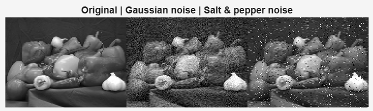
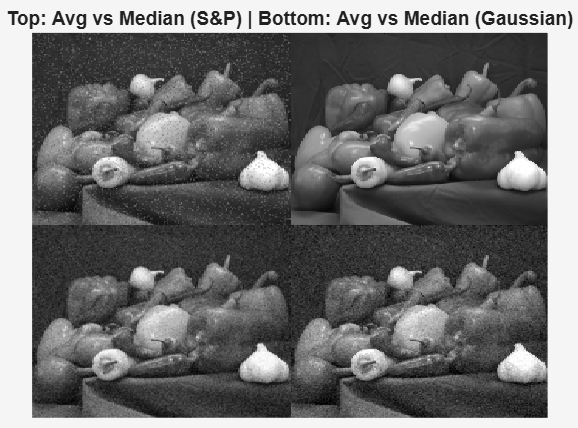

# 🧪 Lab 4 — Noise and Filtering

## 🎯 Objective
The goal of this lab is to model common image noise types and compare different filtering methods for noise reduction.  
We also measure image quality using Mean Square Error (MSE).

---

## 1️⃣ Adding Different Noise Types
  
**Explanation:**  
- The original image (`peppers.png`) was converted to grayscale.  
- Gaussian noise (σ² = 0.01) and Salt & Pepper noise (density = 0.05) were added.  
- Gaussian noise appears as smooth grain, while salt & pepper shows sharp white and black pixels.

---

## 2️⃣ Computing Simple Quality Metrics
**Explanation:**  
- Mean Square Error (MSE) was calculated between the original and noisy images.  
- Expected output (example):  

- Salt & Pepper noise produces higher MSE, meaning stronger degradation.

---

## 3️⃣ Linear Filtering (Mean & Gaussian Filters)
  
**Explanation:**  
- Applied a 3×3 average filter and a 3×3 Gaussian filter (σ = 0.7).  
- Both reduce noise, but linear filters blur edges slightly.  
- Gaussian filtering maintains smoother transitions than the mean filter.

---

## 4️⃣ Non-linear Filtering (Median Filter)
**Explanation:**  
- Median filtering was applied to both Gaussian and Salt & Pepper noisy images.  
- The median filter effectively removed salt & pepper noise without blurring edges.  
- For Gaussian noise, the improvement was moderate compared to linear filters.

---

## 5️⃣ Comparing Metrics After Filtering
**Explanation:**  
- Example of MATLAB output:  
- Median filtering achieves much lower MSE for Salt & Pepper noise, confirming it performs best for impulsive noise.

---

## 6️⃣ Reflections
- **Best filter for Salt & Pepper noise:** Median filter (removes outliers effectively).  
- **Why linear filters blur edges:** They average pixels uniformly, reducing contrast at boundaries.  
- **Improvement idea:** Adaptive filtering that changes behavior based on local image variance can preserve edges better.

---

✅ **Summary**
This lab demonstrated that while linear filters reduce Gaussian noise efficiently,  
non-linear filters like the median filter are superior for removing Salt & Pepper noise without sacrificing edge detail.
