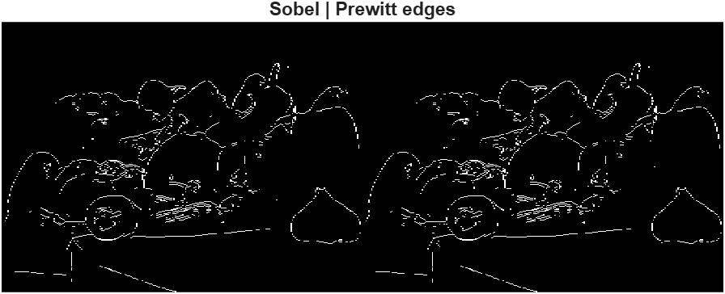
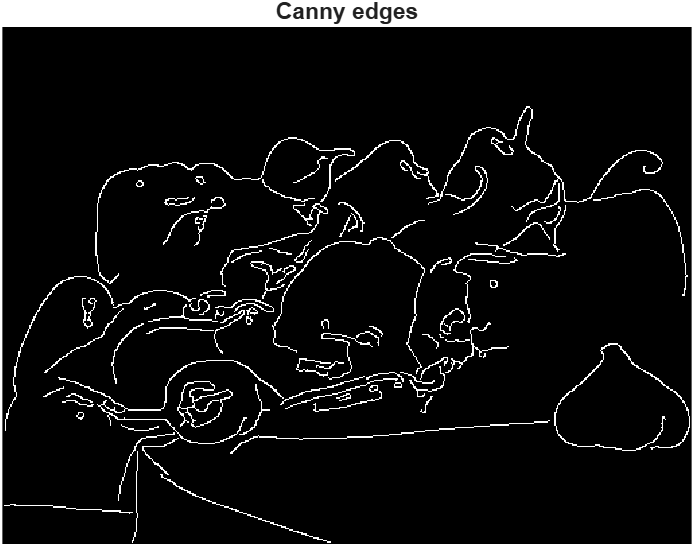
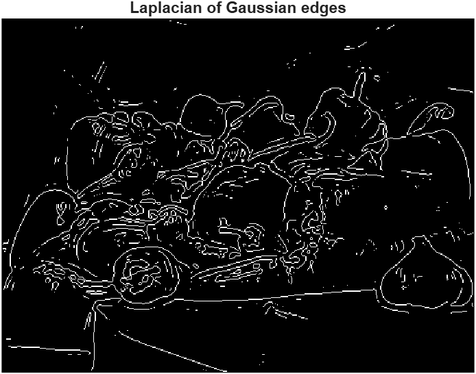
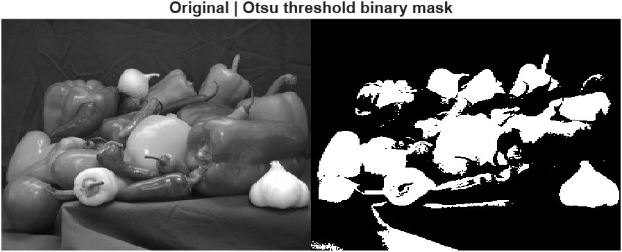
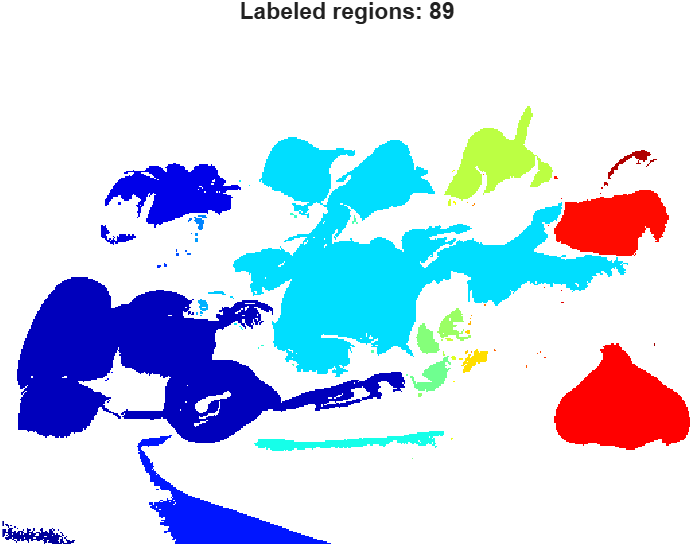

# 🔍 Lab 5 — Edge Detection and Segmentation

## 🎯 Objective
The goal of this lab is to understand the relationship between image edges and high-frequency components.  
We apply several edge detection operators and perform automatic segmentation using Otsu thresholding.

---

## 1️⃣ Basic Derivative Filters (Sobel & Prewitt)
  
**Explanation:**  
- Applied Sobel and Prewitt edge detectors to the grayscale `peppers.png`.  
- Sobel emphasizes stronger vertical and horizontal edges,  
  while Prewitt produces smoother, less sharp results.

---

## 2️⃣ Canny Edge Detector
  
**Explanation:**  
- The Canny detector applies gradient filtering, non-maximum suppression, and double thresholding.  
- It generates **thin and clean edges** with reduced noise.  
- Threshold range used: `[0.05, 0.2]`.

---

## 3️⃣ Laplacian of Gaussian (LoG)
  
**Explanation:**  
- LoG detects edges by identifying zero-crossings in the Laplacian of a Gaussian-smoothed image.  
- It reveals **fine contours** and regions with subtle intensity transitions.

---

## 4️⃣ Otsu Thresholding → Binary Segmentation
  
**Explanation:**  
- The Otsu method automatically finds a global threshold based on image histogram variance.  
- The resulting binary mask separates bright and dark regions effectively.  
- MATLAB function used: `graythresh()`.

---

## 5️⃣ Region Labeling and Visualization
  
**Explanation:**  
- Each connected component in the binary image was labeled using `bwlabel()`.  
- The regions were color-coded using `label2rgb()`.  
- Example output:  

---

## 6️⃣ Reflections
- **Thinnest and cleanest edges:** Canny operator.  
- **Why Canny outperforms simple filters:** It uses gradient magnitude, non-max suppression, and hysteresis thresholding for accuracy.  
- **Otsu’s method:** A histogram-based approach that finds the threshold minimizing intra-class variance.

---

✅ **Summary**
This lab demonstrated how different edge detectors capture image structure in unique ways.  
Canny provided the cleanest results, and Otsu thresholding successfully segmented regions for further analysis.
