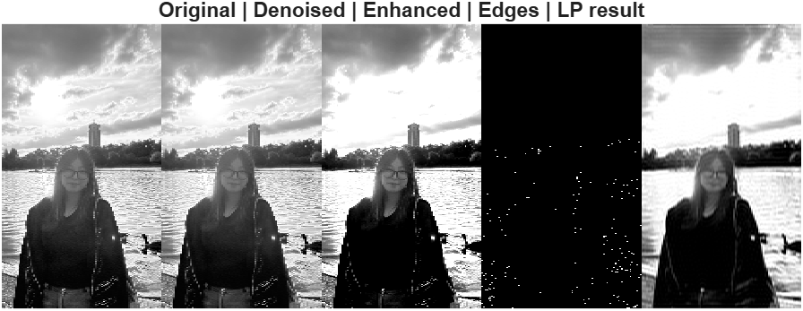
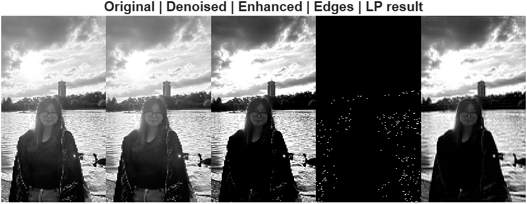
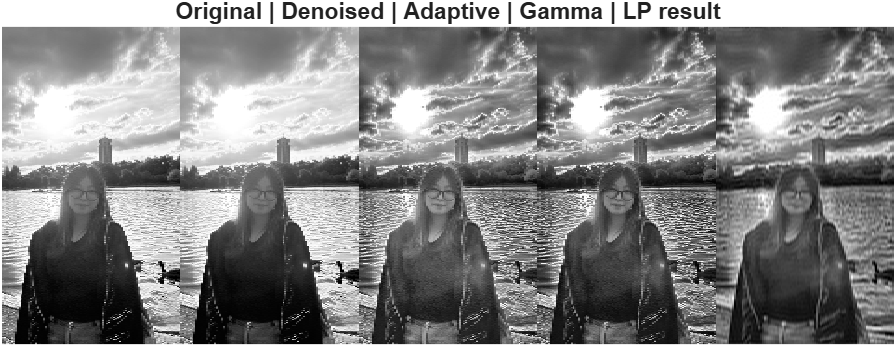

# 🌄 Lab 6 — Mini Project: Integrated Image Processing

## 📘 Project Goal

Combine all DSP-image concepts—**filtering, frequency, edges, and enhancement**—into a single pipeline.

**Problem Defined:** Strong sunlight in a photo causes overexposed highlights. The goal is to reduce overexposure while preserving shadows and details.

---


## Step 0: Image Selection


* **Selected Image:** Strong sunlight photo
* **Reason:** Contains bright sunlight areas causing overexposure, suitable for testing DSP image processing concepts.

---


## Step 1: Initial Pipeline Attempt


**Objective:** Apply basic filtering and contrast enhancement

```matlab
I = im2double(rgb2gray(imread('Hyejin1.jpg')));
I_filt = medfilt2(I,[3 3]);
I_enh = imadjust(I_filt,[0.2 0.8],[0 1]);
edges = edge(I_enh,'Canny',[0.1 0.25]);
F = fftshift(fft2(I_enh));
```

### Observations

* The sunlight is too bright, causing the entire image to be overly bright.
* Simple contrast adjustment alone cannot control the overexposed sunlight areas.

### Lessons Learned

* Solving the problem with simple contrast adjustment is difficult.
* A method is needed to selectively adjust only the sunlight areas.

---


## Step 2: Gamma Correction Attempt


**Objective:** Reduce sunlight overexposure using global gamma adjustment

```matlab
I_filt = medfilt2(I, [3 3]);
gamma = 1.6;
I_gamma = I_filt .^ gamma;
I_enh = imadjust(I_gamma, [0.1 0.9], [0 1]);
edges = edge(I_enh, 'Canny', [0.1 0.25]);
```

### Observations

* Applying Gamma > 1 can mitigate the brightness in the sunlight areas.
* However, the entire image becomes darker, affecting the shadow regions as well.

### Lessons Learned

* A global brightness adjustment method also affects areas other than the sunlight region.
* An approach is needed that can selectively reduce brightness only in the sunlight areas.

---

## Step 3: Final Pipeline — Adaptive Sunlight Reduction


**Objective:** Reduce overexposure in sunlight areas while preserving shadows

```matlab
% 1) Noise removal
I_filt = medfilt2(I, [3 3]);

% 2) Adaptive histogram equalization (CLAHE)
I_adapt = adapthisteq(I_filt, 'ClipLimit',0.01, 'Distribution','rayleigh');

% 3) Mild gamma correction
gamma = 1.2;
I_gamma = I_adapt .^ gamma;

% 4) Edge detection (Canny)
edges = edge(I_gamma, 'Canny', [0.1 0.25]);

% 5) Frequency-domain low-pass filter
F = fftshift(fft2(I_gamma));
[M, N] = size(F);
[u, v] = meshgrid(-N/2:N/2-1, -M/2:N/2-1);
D = sqrt(u.^2 + v.^2);
H = double(D < 60);
I_lp = real(ifft2(ifftshift(F .* H)));
```

### Observations

* Small noise removed with Median filter.
* CLAHE suppresses only the bright areas, mitigating highlights while maintaining shadows.
* Mild gamma application slightly reduces only the sunlight areas, minimizing impact on shadows.
* Edge detection + Low-pass filter preserves structure and softens high-frequency patterns.

### Lessons Learned

* Step-by-step DSP processing and selective application are key to improving results.
* A combination of CLAHE + Mild Gamma can selectively control bright areas.
* Frequency filters can be used to preserve structure while softening excessive detail.

---

## Step 4: Visualization

### Pipeline Stages (Montage Images)

* Original
* Denoised (Median Filter)
* Adaptive Histogram (CLAHE)
* Gamma Corrected
* Frequency Low-pass Result

At each stage, mitigation of sunlight overexposure, preservation of shadows, and edge retention can be confirmed.

---

## Step 5: Reflections

**Final Pipeline:** Median Filter → Adaptive Histogram (CLAHE) → Mild Gamma → Edge Detection → Frequency Low-pass

### Key Learnings

* Step-by-step parameter adjustment according to the problem definition is necessary.
* By appropriately combining CLAHE and Gamma, selective correction of overexposed areas is possible.
* Frequency-domain processing can soften high-frequency patterns to achieve a more natural result.

### Future Improvements

* Selective brightness adjustment in color images.
* Application of regional frequency masks.
* Automatic tuning of CLAHE parameters.
