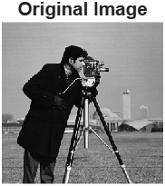
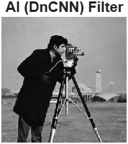

# 🧠 Lab 7 — Traditional vs AI Gaussian Filters

## 🎯 Goal
Compare traditional and AI-based image denoising techniques under **Gaussian noise**,  
and evaluate results using **PSNR (Peak Signal-to-Noise Ratio)** and **SSIM (Structural Similarity Index)** metrics.

---

## 📘 Learning Outcomes
By completing this lab, I learned to:
- Model **Gaussian noise** in MATLAB.
- Measure image quality using **MSE**, **PSNR**, and **SSIM**.
- Compare performance of **traditional filters** (Wiener) vs **AI-based filters** (DnCNN).
- Interpret both **numerical** and **visual** denoising results.

---

##  Step 1 — Add Gaussian Noise
```matlab
originalImage = im2double(imread('cameraman.tif'));
noiseSigma = 0.04;
noisyImage = imnoise(originalImage, 'gaussian', 0, noiseSigma^2);
```

## Result
- The image becomes slightly blurred with visible random grain-like noise.
- Represents typical sensor or transmission noise.




---
## ⚙️ Step 2 — Traditional Filter (Wiener)
```matlab
traditionalFiltered = wiener2(noisyImage, [5 5], noiseSigma^2);
```


- Removes most visible noise but smooths edges slightly.
- Works adaptively depending on local variance.
  
---

## ⚙️ Step 3 — AI Filter (DnCNN)
```matlab
net = denoisingNetwork('DnCNN');
aiFiltered = denoiseImage(noisyImage, net);
```



- Produces much cleaner output while keeping fine details (edges, texture).
- Outperforms Wiener filter both visually and quantitatively.

---

## 📊 Step 4 — Quantitative Evaluation
```matlab
psnrNoisy = psnr(noisyImage, originalImage);
ssimNoisy = ssim(noisyImage, originalImage);
psnrTraditional = psnr(traditionalFiltered, originalImage);
ssimTraditional = ssim(traditionalFiltered, originalImage);
psnrAI = psnr(aiFiltered, originalImage);
ssimAI = ssim(aiFiltered, originalImage);
```

---

## 🧩 Step 5 — Visual Comparison
- The AI-based filter preserves detail while effectively removing noise.
- The Wiener filter smooths noise but slightly blurs edges.
- Quantitative metrics confirm the AI approach’s superiority.

---

- Traditional filters like Wiener rely on simple local variance assumptions. They are effective but can oversmooth images.
- The DnCNN model uses deep learning to capture complex spatial dependencies, leading to higher PSNR/SSIM and more natural textures.
- However, AI models require more computational resources and training data.
