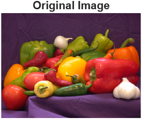
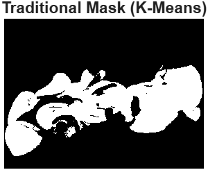
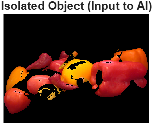
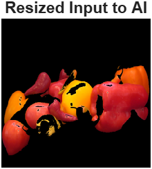

# 🤖 Lab 8 — Hybrid Project: Traditional + AI

## 🎯 Goal
Build a **hybrid computer vision pipeline** that combines:
1. Traditional pre-processing (segmentation, masking)
2. AI-based classification (pre-trained CNN)

and analyze how using both methods together improves results over using only one.

---

## 📘 Learning Outcomes
After completing this lab, I learned to:
- Combine **traditional** and **AI-based** techniques in a single workflow.
- Apply **K-Means color segmentation** to isolate the object of interest.
- Use a **pre-trained CNN (SqueezeNet)** for image classification.
- Understand how segmentation enhances AI classification accuracy.

---

## ⚙️ Section 1 — Load Image and AI Network

```matlab
targetImage = imread('peppers.png');
net = squeezenet;
```


- Loaded a sample image (peppers.png).
- Loaded SqueezeNet, a lightweight CNN pre-trained on ImageNet.
- Displayed the original image in a figure window.

---

## ⚙️ Section 2 — Traditional Method: Color Segmentation (K-Means)

```
imgLab = rgb2lab(targetImage);
ab = imgLab(:,:,2:3);
ab = im2single(ab);
pixelLabels = imsegkmeans(ab, 2);
mask = pixelLabels == 2;
isolatedObject = targetImage;
isolatedObject(repmat(~mask, 1, 1, 3)) = 0;
```


- Converted the image into the L*a*b* color space for better color clustering.
- Used K-Means clustering (k = 2) to separate the object from the background.
- Generated a binary mask to isolate the main object.
- Applied the mask to the image, setting background pixels to black.

- This traditional segmentation simplifies the image for the AI model so that it focuses only on the relevant object (foreground).

---

## ⚙️ Section 3 — AI Method: Image Classification (SqueezeNet)

```
inputSize = net.Layers(1).InputSize;
resizedObject = imresize(isolatedObject, [inputSize(1) inputSize(2)]);
[YPred, probs] = classify(net, resizedObject);
```



- Resized the isolated image to 227×227×3 (required by SqueezeNet).
- Classified the object using the pre-trained CNN.
- Displayed the predicted label and confidence score.

---

## 📊 Section 4 — Comparison & Analysis

- Traditional (K-Means): Removes background efficiently.
- AI (SqueezeNet): Recognizes object features accurately.
- Hybrid: Best of both worlds — simpler input + strong classification.

---

## 💬 Reflections

- Traditional techniques like K-Means segmentation are effective for quick preprocessing.
- Deep learning methods like SqueezeNet provide robust feature extraction and classification.
- Combining them yields a hybrid pipeline that: Reduces background noise, Improves model focus and confidence, Produces more interpretable results.
- This demonstrates how classical DSP and modern AI methods can complement each other in real-world vision tasks.
